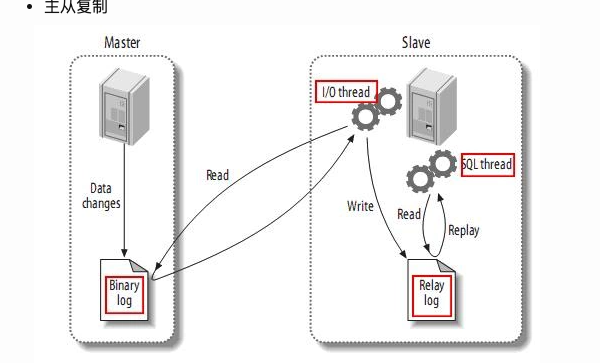

构架 Architecture:
one master, multiple slaves(replication), separate write and read:
1. one master for writing
2. multiple slaves for reading
3. sync master and slaves

Advantages:
1. horizontally scale, secrete write and read. 
2. data is secure: slave can stop anytime to back up the data
3. data analysis in the slave, would not affect master's ability
4. remote data transfer from slave

Disadvantages:
- cost:        
无可厚非的是搭建主从肯定会增加成本，毕竟一台服务器和两台服务器的成本完全不同，另外由于主从必须要开启二进制日志，所以也会造成额外的性能消耗
- delay:        
Slave从Master复制过来肯定是会有一定的数据延迟的，所以当刚插入就出现查询的情况，可能查询不出来，当然如果是插入者自己查询，那么可以直接从Master中查询出来，当然这个也是需要用代码来控制的
- slower to write:      
主从复制主要是针对读远大于写或者对数据备份实时性要求较高的系统中，因为Master在写中需要更多操作，而且只有一台写入的Master（因为我目前只会配置一台写入Master，最多就是有从Master的Slave，用来在Master挂掉后替换成Master，平时不对外进行服务），所以写入的压力并不能被分散。

## MySql:      
MySQL主从复制的基础是主服务器对数据库修改记录二进制日志，从服务器通过主服务器的二进制日志自动执行更新。

### 实现方式        

#### 基于语句
主服务器上面执行的语句在从服务器上面再执行一遍，在MySQL-3.23版本以后支持。

存在的问题：时间上可能不完全同步造成偏差，执行语句的用户也可能是不同一个用户。

#### 基于行

把主服务器上面改编后的内容直接复制过去，而不关心到底改变该内容是由哪条语句引发的，在MySQL-5.0版本以后引入。

存在的问题：比如一个工资表中有一万个用户，我们把每个用户的工资+1000，那么基于行的复制则要复制一万行的内容，由此造成的开销比较大，而基于语句的复制仅仅一条语句就可以了。

#### 混合类型
MySQL默认使用基于语句的复制，当基于语句的复制会引发问题的时候就会使用基于行的复制，MySQL会自动进行选择。

在MySQL主从复制架构中，读操作可以在所有的服务器上面进行，而写操作只能在主服务器上面进行。

主从复制架构虽然给读操作提供了扩展，可如果写操作也比较多的话（多台从服务器还要从主服务器上面同步数据），单主模型的复制中主服务器势必会成为性能瓶颈。

## MySQL主从复制（BinaryLog）

### 主流方式

1. 基于 BinaryLog 的比较传统的方式 这种方式log文件和文件中的同步位置

2. 基于 GlobalTransactionIdentifiers (GTIDs) 这种方式比较新，暂未研究

### 工作原理
主服务器上面的任何修改都会保存在二进制日志Binary log里面，从服务器上面启动一个I/O thread（实际上就是一个主服务器的客户端进程），连接到主服务器上面请求读取二进制日志，然后把读取到的二进制日志写到本地的一个Realy log里面。

从服务器上面开启一个SQL thread定时检查Realy log，如果发现有更改立即把更改的内容在本机上面执行一遍。

